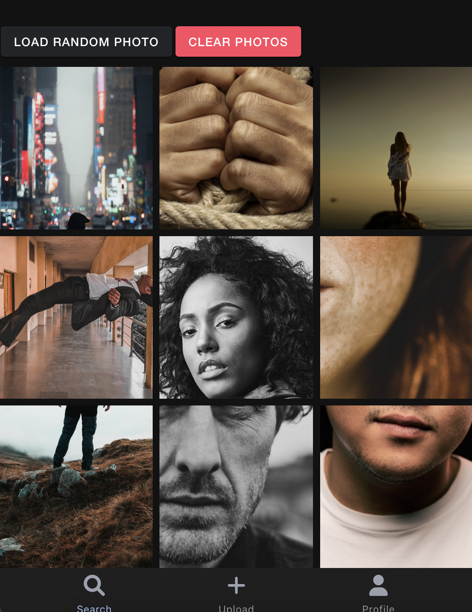

This project showcases the use of Angular 12 in combination with Ionic 6. The goal was to build a PWA with a codebase that can be reused for accross multiple platforms. The current code base is tested on MacOS, Windows, Android and native IOS. Styling was done with the help of TailwindCSS.

It showcases a simple gallery app that can take and store pictures accross all the mentioned platforms. 

# Demo
Try it out for yourself at https://gitlab.com/frankhartman/angular-ionic

# Run web version locally
- npm install
- ionic serve

# Run native IOS version locally
- npm install
- ionic capacitor sync ios
- ionic capacitor copy ios
